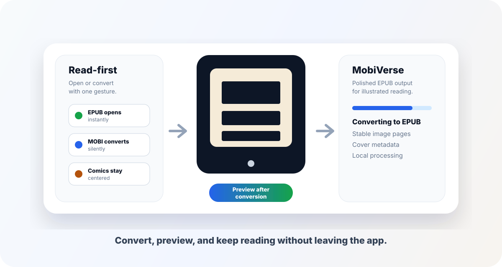
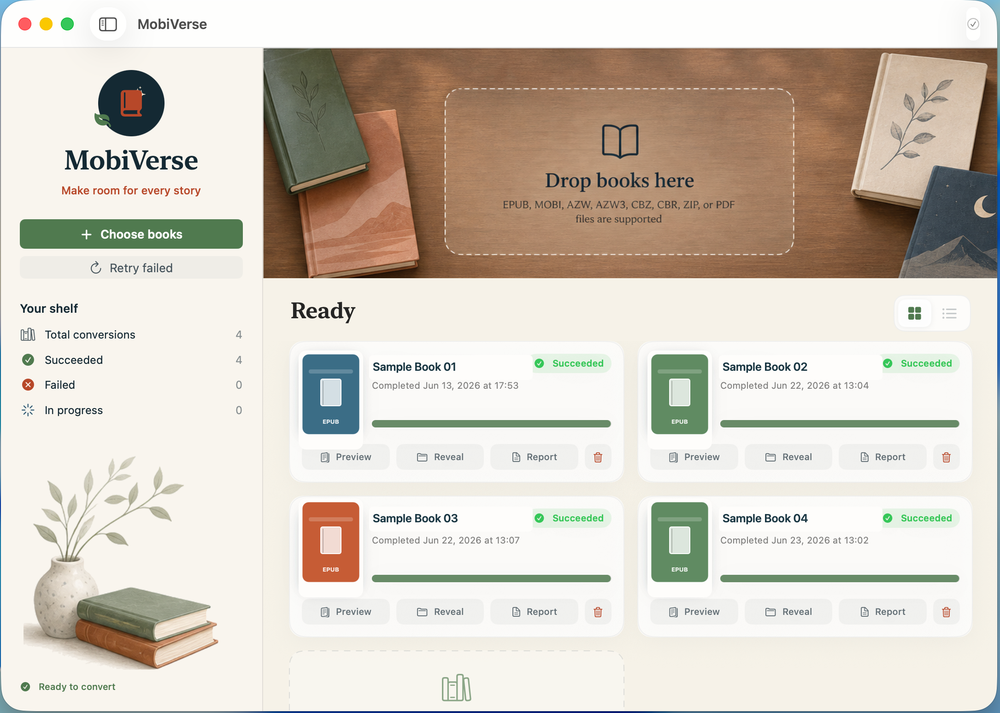
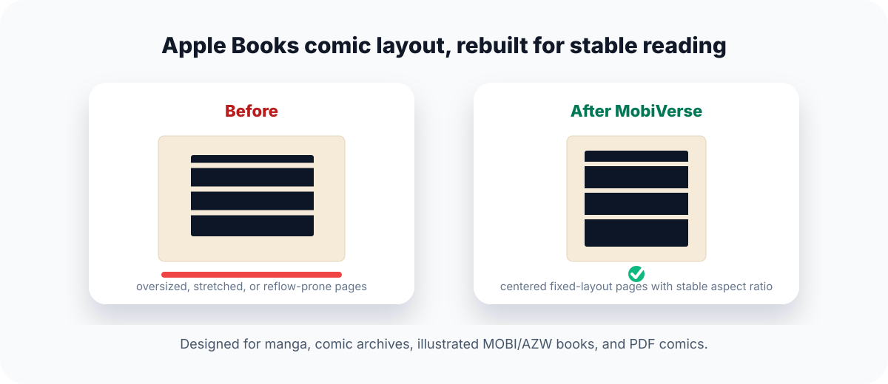

# MobiVerse

> 中文说明：[README.zh-CN.md](README.zh-CN.md)

**A native macOS reader-converter for opening EPUBs directly and turning Kindle books, comic archives, and PDF comics into polished EPUBs for Apple Books and modern EPUB readers.**

<p align="center">
  
</p>

<p align="center">
  <a href="https://github.com/DemonDevil-Git/MobiVerse/releases/latest/download/MobiVerse-2.0.0.dmg"></a>
  <a href="https://github.com/DemonDevil-Git/MobiVerse/releases"></a>
  <a href="LICENSE"></a>
</p>

<p align="center">
  <strong>No Calibre installation required for readers.</strong> Best for manga, illustrated Kindle books, comic archives, and Apple Books-friendly EPUB output.
</p>

## Product Showcase

<p align="center">
  
</p>

## Why MobiVerse

- **A calmer 2.0 library workspace**  
  MobiVerse 2.0 replaces the plain utility layout with a warm macOS bookshelf interface, a clear drag-and-drop reading desk, sidebar conversion stats, and polished conversion cards.

- **Made for comics and illustrated books**  
  Image pages are rebuilt into clean fixed-layout EPUB3 pages with stable sizing, no unexpected margins, and right-to-left manga metadata.

- **Read-first opening flow**
  Open an EPUB instantly, or open MOBI/AZW/comic/PDF sources and let MobiVerse quietly convert them before showing the preview.

- **Works without asking readers to install Calibre**  
  The distributable app can bundle Calibre so conversion works immediately after installation.

- **Apple Books friendly**  
  MobiVerse writes cover metadata, fixed-layout display options, and self-contained image pages to avoid stretched or black pages.

- **Built-in EPUB preview**  
  Open converted EPUBs directly in the app, flip through image pages with native horizontal paging, zoom in, and use fullscreen preview.

- **Real cover thumbnails**  
  Completed books show the converted EPUB cover in the shelf instead of generic file tiles. Covers are cached locally so reopened sessions restore the shelf quickly.

- **Grid and list shelf views**  
  Switch between a visual grid and a denser list layout from the shelf toolbar.

- **Batch conversion with history**  
  Drag in multiple books, track progress, reveal outputs, open reports, and keep conversion history across launches. The completed list keeps titles and status visible without exposing full local file paths in the UI.

<p align="center">
  
</p>

## Supported Files

| Format | Use case |
| --- | --- |
| EPUB | Open directly in the built-in preview |
| MOBI, AZW, AZW3 | Kindle-style ebooks without DRM |
| CBZ, ZIP | Comic archives made from ordered image files |
| CBR | RAR-based comic archives readable by Calibre |
| PDF | PDF comics and image-heavy documents |

MobiVerse does not remove DRM. Protected or unreadable files are reported clearly.

## Install

1. Download the latest DMG: [MobiVerse-2.0.0.dmg](https://github.com/DemonDevil-Git/MobiVerse/releases/latest/download/MobiVerse-2.0.0.dmg).
2. Open `MobiVerse-2.0.0.dmg`.
3. Drag `MobiVerse.app` into `Applications`.
4. Launch MobiVerse and drop supported files into the window, or open supported files with MobiVerse from Finder.

Converted EPUB files are written next to the original source file without overwriting existing EPUBs.

The release app bundles Calibre, so readers do not need to install Calibre separately.

If macOS shows an "Apple could not verify MobiVerse" warning, that DMG was built without Apple Developer ID notarization. Public releases should be signed, notarized, and stapled before upload.

## Preview

The built-in preview focuses on comic/image-page EPUBs:

- native horizontal page swiping
- fullscreen preview
- zoom in, zoom out, and fit controls
- current-page recentering after fullscreen/window size changes

Text EPUBs fall back to a simple WebView preview.

## What's New in 2.0

- Redesigned warm bookshelf UI with a large visual drop zone and reading-inspired artwork.
- Sidebar shelf summary for total conversions, successes, failures, and active jobs.
- Completed EPUB cards now show extracted cover thumbnails.
- Local thumbnail cache prevents already-loaded covers from flashing in on every relaunch.
- Grid/list view switcher for the conversion shelf.
- Cleaner completed-book cards that omit full source file paths.
- Packaged image resources are included in app bundles and DMG builds.

## Roadmap

- Signed and notarized public DMG.
- Optional EPUBCheck bundle for richer validation reports.
- More explicit reading-direction controls for manga and western comics.
- Better metadata editing for title, author, cover, and series fields.

## FAQ

### Do readers need to install Calibre?

No. Release builds bundle Calibre, so readers can convert supported files after installing MobiVerse.

### Does MobiVerse remove DRM?

No. MobiVerse only converts DRM-free or otherwise readable files. Protected files are reported as conversion failures.

### Why does macOS say Apple cannot verify the app?

The current public DMG is not Apple Developer ID notarized yet. A notarized build is on the release roadmap.

### Where are converted EPUB files saved?

MobiVerse writes EPUBs next to the original source file and avoids overwriting existing files.

### Is my book uploaded anywhere?

No. Conversion runs locally on your Mac.

## Privacy

MobiVerse runs locally on your Mac. Your books are not uploaded to a server by this app.

## Development

### Requirements

- macOS 14 or later
- Swift 6 / Xcode 26 or later
- A local Calibre app only on the build machine, used as the source copied into distributable app bundles. Defaults to `/Applications/calibre.app`; override with `CALIBRE_APP=/path/to/calibre.app`.
- Optional: `epubcheck` in `PATH` or `EPUBCHECK_JAR=/path/to/epubcheck.jar`

### Run from source

```sh
swift run Mobi2EpubTransfer
```

Development runs use bundled Calibre when launched from an app bundle created by `scripts/package-app.sh`. Otherwise, they fall back to a system Calibre installation.

### Package app

```sh
scripts/package-app.sh
```

The generated app is written to:

```text
.build/MobiVerse.app
```

### Package DMG

```sh
scripts/package-dmg.sh
```

The generated installer image is written to:

```text
.build/MobiVerse-2.0.0.dmg
```

Development builds use ad-hoc signing by default. They are suitable for local testing, but macOS Gatekeeper will block them after download from the internet.

### Package a notarized release

Public macOS distribution requires an Apple Developer Program account, a `Developer ID Application` certificate in Keychain, and Apple notarization credentials.

Store notarization credentials once:

```sh
xcrun notarytool store-credentials mobiverse-notary \
  --apple-id "you@example.com" \
  --team-id "TEAMID" \
  --password "app-specific-password"
```

Then build the release DMG:

```sh
SIGN_IDENTITY="Developer ID Application: Your Name (TEAMID)" \
BUNDLE_IDENTIFIER="com.yourcompany.mobiverse" \
NOTARIZE=1 \
NOTARYTOOL_PROFILE="mobiverse-notary" \
scripts/package-dmg.sh
```

The script signs the app with hardened runtime and timestamp, signs the DMG, submits it to Apple notarization, staples the ticket, and validates the final DMG.

### Bundle EPUBCheck

```sh
EPUBCHECK_JAR=/path/to/epubcheck.jar scripts/package-dmg.sh
```

## Test

```sh
swift test
```

## License

MobiVerse is licensed under GPLv3 or later.

If you distribute an app bundle that includes Calibre, also satisfy Calibre's GPLv3 source-code distribution requirements for the bundled Calibre version. See [ThirdPartyNotices.md](ThirdPartyNotices.md).
